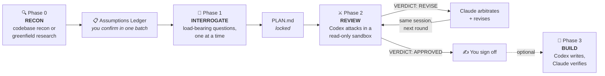

<div align="center">

# 🔥 crucible

### Two AI models harden your plan before a line of code exists — then swap jobs to build it.

[](https://github.com/chaseai-yt/crucible/stargazers)
[](./LICENSE)
[](https://docs.anthropic.com/en/docs/claude-code)
[](https://github.com/openai/codex)

*The plan that sounds finished usually isn't. In crucible's first real run, a deeply-researched, interview-locked plan still contained **one unbuildable subsystem and six designs that would have corrupted data** — a rival model found all of them before any code existed.*

</div>

---

## Why

AI-assisted coding fails in two places: the gap between **you and Claude** (do we agree on what to build?) and the gap between **Claude and its own output** (is the plan actually correct — and how would you even know?). The model that wrote the plan can't be trusted to grade it. That's an echo chamber.

Crucible closes both gaps: Claude locks intent *with you*, then **OpenAI Codex** — a rival, cross-provider model — attacks the locked plan round after round until it can't find anything else wrong.



**You enter at three points only:** confirming the ledger, answering the interview, signing off the converged plan. Codex is read-only throughout review and never touches a file.

## The three phases

| | What happens | What makes it different |
|---|---|---|
| **🔍 RECON** | Claude scouts *before* asking you anything — explores the codebase and living docs, or on greenfield researches prior art, stacks, and known pitfalls (research depth is a gate **you** control, up to a multi-agent deep-research workflow) | Opens with an **Assumptions Ledger**: everything already resolved, batch-confirmed in one reply. The interview never wastes questions the code or research already answered |
| **🎯 INTERROGATE** | A visible **decision map** splits open decisions into load-bearing (asked one at a time) and cosmetic (batched, veto-by-exception) | Every question must justify its existence: *why it matters*, a committed *recommendation*, and *what breaks if we guess wrong*. Escape hatch: "accept all remaining recommendations" |
| **⚔️ REVIEW** | Codex reviews `PLAN.md` in a read-only sandbox → `VERDICT: APPROVED` or `REVISE` with concrete flaws. Claude arbitrates (rejects bad critiques *with logged reasons*), revises, and resumes the **same Codex session** | The reviewer remembers its prior findings and attacks its own accepted fixes. Bounded by `MAX_ROUNDS` — a flagged deadlock beats a fake "approved" |

**Phase 3 (optional) — the roles flip.** `codex-build` hands the frozen plan to Codex with full write access; Claude becomes the critic, reads the entire diff like a contributor PR, and runs the proof test itself. Cross-model checks in both directions — nobody grades their own work.

Two artifacts every run: `PLAN.md` (the *what*) and `PLAN-REVIEW-LOG.md` (the full round-by-round argument — the *why*).

## Receipts

From the first end-to-end greenfield run (a solo-creator CRM):

- **55 findings across 5 rounds** — converging 26 → 15 → 12 → 2 → 0
- **1 fatal:** an access-path architecture that could not be built as written (read as completely plausible)
- **~6 wrong models** that would have shipped and corrupted data weeks later
- **~7 missing subsystems**, including the homepage feature that had no backing data source
- **What survived untouched:** every product decision from the interview. The review only ever attacked *how it would break* — the phases genuinely divide the labor

## Install

### Option A — Plugin *(recommended: updates flow automatically)*

```
/plugin marketplace add chaseai-yt/crucible
/plugin install crucible@crucible
```

Skills arrive namespaced: `/crucible:crucible`, `/crucible:codex-review`, `/crucible:codex-build`. (Intent triggering works regardless — say "crucible this plan" and the right skill fires.) Enable auto-update for the marketplace in the `/plugin` menu and new versions pull in on their own.

### Option B — Manual copy *(bare skill names)*

```bash
# macOS / Linux
cp -r skills/* ~/.claude/skills/

# Windows (PowerShell)
Copy-Item -Recurse skills\* $env:USERPROFILE\.claude\skills\
```

Invoke as `/crucible`, `/codex-review`, `/codex-build`. Update by `git pull` + re-copy.

> **Coming from grill-me-codex?** This repo *was* grill-me-codex — GitHub redirects the old URL, so `git pull` in your existing clone just works. The old skills live on in [`legacy/`](./legacy/) (copy them only if you want them; `/crucible` doesn't need them).

## Prerequisites

- **Codex CLI ≥ 0.130** — `npm install -g @openai/codex@latest`
- **Authenticated** — `codex login` once (any ChatGPT account: Free/Plus/Pro/Max)
- **Don't pin a model** — ChatGPT-account auth rejects `gpt-5.x-codex` variants; the skills use your config default and echo the active model at kickoff so you can veto before a round burns

## Tunables

| Skill | Var | Default | Meaning |
|-------|-----|---------|---------|
| `crucible` | `research` | ask | `none` / `web` / `deep` — pre-answers the Phase 0 research gate |
| review skills | `MAX_ROUNDS` | `5` | Hard cap on review rounds |
| review skills | `PLAN_FILE` | `PLAN.md` | Where the plan lives |
| all | `LOG_FILE` | `PLAN-REVIEW-LOG.md` | The argument transcript |
| `codex-build` | `SPEC_FILE` | `PLAN.md` | The frozen spec Codex implements |
| `codex-build` | `MAX_FIX_ROUNDS` | `2` | Fix rounds before Claude takes over |
| `codex-build` | `PROOF_CMD` | from spec | Exact test command that counts as proof |

Pass e.g. `rounds=3` when invoking to override.

## Safety

**Review (Phases 0–2):** Codex runs **read-only every round** — `-s read-only` on the first call, `-c sandbox_mode="read-only"` on every resume (the `resume` subcommand doesn't accept `-s`, and without forcing read-only it would inherit your `config.toml` sandbox default, which may be `danger-full-access`). The skills handle this for you. No code is written until you approve the final plan.

**`codex-build` (Phase 3)** deliberately inverts this: Codex gets full write access — which is exactly why the skill gates it hard. Clean git tree before launch, Claude reads every line of the diff and runs the proof itself, fix rounds bounded, commits human-gated and Claude-authored. Resume calls need the long flag `--dangerously-bypass-approvals-and-sandbox` (resume has no `--yolo`) — and always resume by explicit `thread_id`, never `--last`.

## Credits

- The [`legacy/`](./legacy/) skills' Act 1 (`grill-me`, `grill-with-docs`) © [Matt Pocock](https://github.com/mattpocock/skills) (MIT) — see their `THIRD-PARTY-NOTICES.md`. Crucible's interview is an original redesign.
- Phase 3's Codex-as-builder pattern adapted from Peter Steinberger's [`codex-first`](https://github.com/steipete/agent-scripts).
- Crucible, the iterative cross-model review, and packaging by [Chase AI](https://youtube.com/@chaseai).

<div align="center">

**Want to go deeper?** The **Claude Code Masterclass** and a community of builders shipping with agentic AI live inside [**Chase AI+**](https://www.skool.com/chase-ai/about)

*MIT — see [LICENSE](./LICENSE)*

</div>
